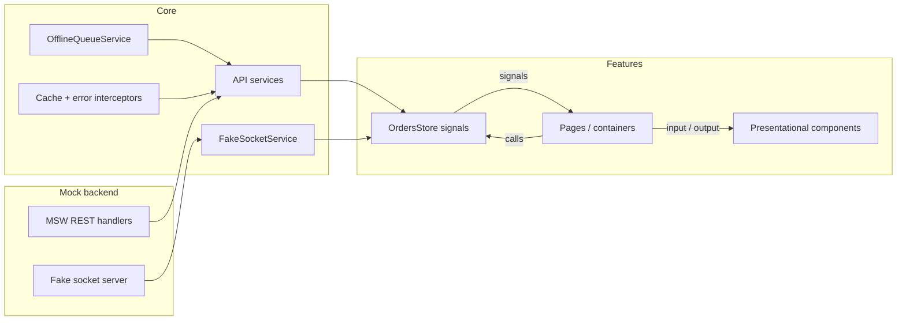
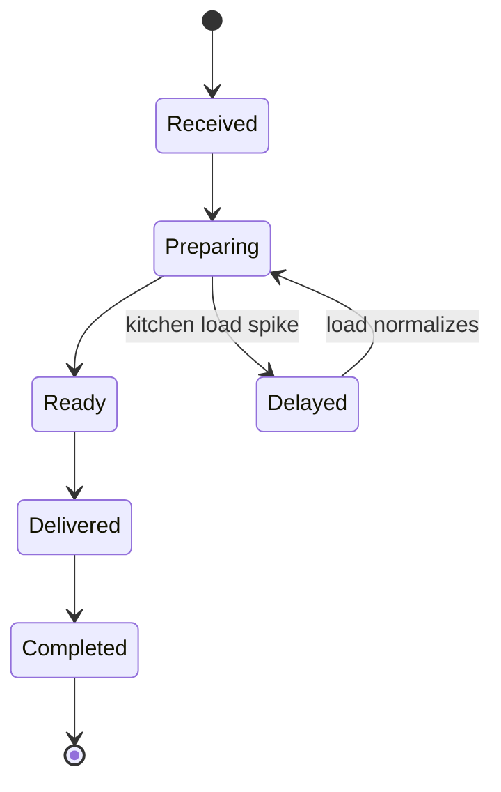
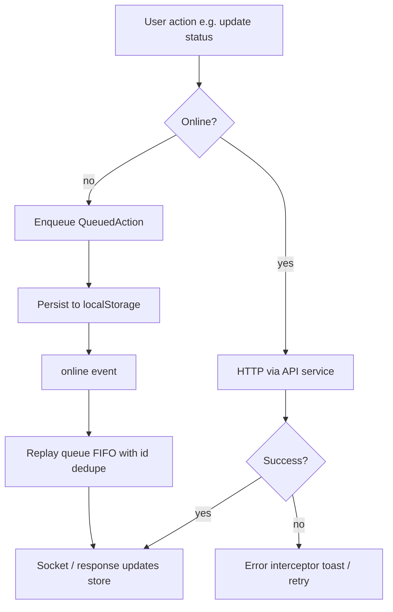

# Sahm Food – Smart Restaurant POS Dashboard

Browser-based restaurant operations dashboard for live order management, kitchen load monitoring, AI-assisted order suggestions, product search, and offline recovery. Built with **Angular 21** (standalone components), **Signals + RxJS**, **PrimeNG**, and an in-browser **MSW** mock backend with a simulated WebSocket.

---

## Quick start

```bash
npm install
npm start
```

Open [http://localhost:4200/](http://localhost:4200/). The mock backend (MSW + fake socket) starts automatically when `environment.useMockBackend` is `true`.

| Script | Purpose |
|--------|---------|
| `npm start` | Dev server + MSW mock API in the browser |
| `npm run build` | Production build → `dist/` |
| `npm test` | Unit tests (Vitest) |
| `npm run mock:api` | Express mock API for Postman/curl on `http://localhost:3333` |

Configuration lives in `src/environments/` (`apiBaseUrl`, mock latency, failure rate, socket tick). No `.env` file is required for the default demo.

Postman collection: `mock-api/Sahm-Food-Mock-API.postman_collection.json` (run `npm run mock:api` first). See [`src/app/mock-backend/README.md`](src/app/mock-backend/README.md) for MSW vs Express details.

---

## Project architecture

The app follows a **feature-based** layout with a thin **core** layer for cross-cutting concerns and a **shared** layer for presentational shell UI.



**Data flow**

1. **REST** — Feature/store code talks only to typed API services (`OrdersApiService`, `KitchenApiService`, `ProductsApiService`, `AiApiService`). MSW intercepts `/api/*` in the browser so `HttpClient` never knows the backend is fake.
2. **Realtime** — `FakeSocketService` wraps an in-browser fake socket that emits `order.created`, `order.updated`, and `kitchen.load.changed`. Features subscribe via typed helpers; swapping to a real WebSocket later does not require UI changes.
3. **UI** — Pages are containers (store/API + routing). Cards and layout chrome are presentational (`input()` / `output()`), kept on `OnPush`.

**Main surfaces**

| Area | Where it lives | Behavior |
|------|----------------|----------|
| Live Orders | `features/live-orders` | Kanban board, drag-to-status, channel filter, modal order details |
| Kitchen load | Dashboard + header | Gauge + load badge; live updates from API + socket |
| AI assistant | Order details panel | Suggestions loaded with the order; streaming/retry APIs available |
| Product search | Header | Debounced search, categories, keyboard nav, infinite scroll, recent searches |
| Offline | `OfflineQueueService` | Queue mutations while offline; replay on reconnect |

---

## Folder structure

```
src/app/
├── core/                         # App-wide singletons
│   ├── api/                      # HttpClient facades (orders, kitchen, products, AI)
│   ├── interceptors/             # Cache + error/retry
│   ├── models/                   # Shared DTOs / API types
│   └── services/                 # Fake socket, connectivity, cache, offline queue, i18n
│
├── shared/                       # Shell + reusable UI
│   ├── components/               # Header, sidebar
│   ├── pipes/                    # e.g. elapsed-time
│   └── services/                 # Toast notifications
│
├── features/
│   ├── dashboard/                # Kitchen load overview (gauge, stations, staff)
│   └── live-orders/
│       ├── components/           # OrderCard (presentational)
│       ├── data/                 # Board mappers
│       ├── models/
│       ├── pages/                # Live board + order details (+ dialog route)
│       ├── stores/               # OrdersStore (signals)
│       └── orders.routes.ts      # Lazy-loaded feature routes
│
├── mock-backend/                 # MSW handlers, seed data, fake socket server
└── app.routes.ts                 # Lazy routes + modal outlet for order details

mock-api/                         # Express twin of the mock API (Postman)
docs/                             # Design system + planning notes
public/assets/i18n/               # en.json / ar.json
src/environments/                 # Dev / prod config + mock tunables
```

**Layering rule:** API/store code does not import from UI. Presentational components receive data via `input()` and emit via `output()`. Pages/containers are the only bridge to stores and API services.

---

## Design decisions

| Decision | Choice | Rationale |
|----------|--------|-----------|
| Framework | Pure Angular web (no Ionic/Capacitor) | Brief targets a browser POS; avoids native scope |
| Components | Standalone + `OnPush` | Smaller bundles, clearer boundaries, fewer unnecessary re-renders |
| State | Signals stores + RxJS (no NgRx) | Enough structure for this domain without store ceremony; easy to explain and extend |
| Mock backend | MSW in-browser + Express for Postman | Real `HttpClient` path; network-layer simulation is part of the evaluation |
| Realtime | Fake WebSocket abstraction | Not polling-only; same consumer API as a future real socket |
| UI kit | PrimeNG (Aura) + design tokens in `docs/DESIGN.md` | Dense dark ops UI; status color + icon pairing for fast recognition |
| i18n | `@ngx-translate` (AR default, EN toggle) | RTL-ready shell for regional restaurant use |
| Order details | Auxiliary router outlet + dialog | Deep-linkable order view without leaving the board context |
| Offline queue | `localStorage` + action IDs | Simple, inspectable persistence for the demo; IndexedDB is a natural next step |

Visual language follows **Professional / Calm / Urgent**: graphite surfaces, high-contrast status accents, Inter for dense legibility, 4px/8px spacing, and left-border status cues on order cards (see [`docs/DESIGN.md`](docs/DESIGN.md)).

---

## State management approach

**Angular Signals** hold UI state; **RxJS** handles async streams (HTTP, socket, search pipeline).

### `OrdersStore` (feature store)

- Private writable signals → public `asReadonly()` surfaces (`orders`, `isLoading`, `error`, `isSubmitting`, filters).
- Derived state via `computed()` (e.g. pending / completed counts).
- Board columns are derived in the page with `computed(() => groupOrdersIntoColumns(store.orders()))`.
- Socket events patch the list in place (add / update / remove by active filter) so the board stays live without full reloads.
- Mutations go through the store; when offline, actions are enqueued and the UI surfaces a warning toast.

### Local component state

- Dashboard load gauge, header search results, and order-details AI suggestions use local signals where state is screen-scoped.
- Kitchen load also updates from `FakeSocketService.kitchenLoadUpdates()` with `takeUntilDestroyed`.

### Why not NgRx

The domain is a handful of entities and one primary live list. A signal store + API services keep the mental model small, make OnPush + `computed` natural, and still leave a clear upgrade path (feature stores → NgRx/SignalStore) if the app grows to many screens and cross-feature workflows.

---

## Performance optimizations

- **Lazy loading** — Dashboard and live-orders routes (and the order modal) use `loadComponent` / `loadChildren`.
- **OnPush everywhere** on feature/shared UI components so change detection runs when inputs/signals change, not on every tick.
- **`@for` with `track`** — Lists track by stable IDs (`order.id`, product `id`, etc.) to reuse DOM nodes during live updates.
- **HTTP GET cache** — `cacheInterceptor` + `CacheService` (TTL, bypass / custom TTL via `HttpContextToken`) cut repeat kitchen/product reads.
- **Search pipeline** — `debounceTime(250)`, `distinctUntilChanged`, `switchMap` cancel in-flight requests; paginated results (`limit`/`offset`) with scroll-triggered load-more.
- **Socket fan-out** — `shareReplay({ bufferSize: 1, refCount: true })` so multiple subscribers share one event stream.
- **ECharts tree-shaking** — Dashboard registers only `GaugeChart` + `CanvasRenderer`.
- **`NgOptimizedImage`** where images appear in order details.
- **Mock backend code-split** — MSW starts via dynamic `import()` in `main.ts` only when `useMockBackend` is enabled.

---

## Assumptions

- Demo runs entirely against the mock backend; no real restaurant API or auth is required.
- Single-operator / single-browser session is enough; no multi-user conflict resolution beyond queue replay.
- Order status pipeline is linear: `received → preparing → ready → delivered → completed` (plus delayed signaling via kitchen load / elapsed flags in seed data).
- Arabic is the default UI language; currency formatting in order details currently uses USD/`en-US` for demo clarity.
- Product search and kitchen load live in the **shell header / dashboard**, not separate routed micro-apps (feature folders for those domains may remain thin).
- Offline means “browser offline / failed network”; Service Worker caching of the app shell is out of scope for v1.
- Fake socket tick interval and REST failure injection are tunable via `environment.mock` for demos and resilience testing.

---

## Known limitations

- **Offline persistence** uses `localStorage`, not IndexedDB — fine for moderate queues, weaker for large payloads or multi-tab sync.
- **Optimistic UI** for offline mutations is partial: actions are queued and toasted; the board does not always apply a full optimistic patch before server confirm.
- **AI assistant** loads suggestions with the order; streaming (`stream=true`) and retry endpoints exist on `AiApiService` but are not fully wired into a streaming UI state machine.
- **Kitchen → orders cascade** (auto-mark delayed / inject AI overload warnings) is not fully centralized in a cross-feature store; kitchen load is reflected mainly on dashboard/header.
- **Product search** is header-embedded (strong UX for POS) rather than a dedicated virtualized full-page module; very large catalogs would need virtual scroll.
- **Cache invalidation** after mutations is not fully automated for all related GET keys.
- **Tests** cover stores, pipes, and key components; broader integration/E2E coverage is limited.
- MSW only intercepts browser traffic; external clients must use `npm run mock:api`.

---

## Future improvements

- Persist the offline queue in **IndexedDB** with multi-tab locks and richer conflict handling.
- Complete the **AI streaming** UX (chunked NDJSON, cancel on order change, exponential backoff retry).
- Dedicated **kitchen-load store** that cascades into order priority badges and AI prompts.
- **Virtual scrolling** for product results and very large order columns.
- Stronger **cache invalidation** tied to mutation success / socket events.
- Expand **unit + integration tests** (offline replay, search debounce, status transitions, AI failure paths).
- Optional **Service Worker** for app-shell offline and background sync.
- Replace the fake socket internals with a real WebSocket client behind `FakeSocketService` without touching features.
- Harden i18n (currency/locale from restaurant settings) and a11y (live regions for new orders, focus traps in dialogs).

---

## Architecture diagrams (domain)

### Order status flow



### Offline mutation flow



---

## Tech stack

- Angular 21, RxJS 7, TypeScript 5.9  
- PrimeNG 21 + Angular CDK (drag-drop)  
- ngx-translate, ngx-echarts / ECharts  
- MSW 2, Express mock API, Vitest  

---

## AI usage disclosure

This project was built with AI-assisted tooling (Cursor) for scaffolding, boilerplate, documentation, and iterative implementation. Architecture choices (Signals over NgRx, MSW + fake socket, feature folders), domain modeling, and final integration/testing decisions were directed and reviewed by the developer. Generated code was edited for OnPush discipline, store boundaries, i18n, and design-system alignment; speculative abstractions that did not match the POS brief were rejected in favor of thinner, demo-defensible modules.
