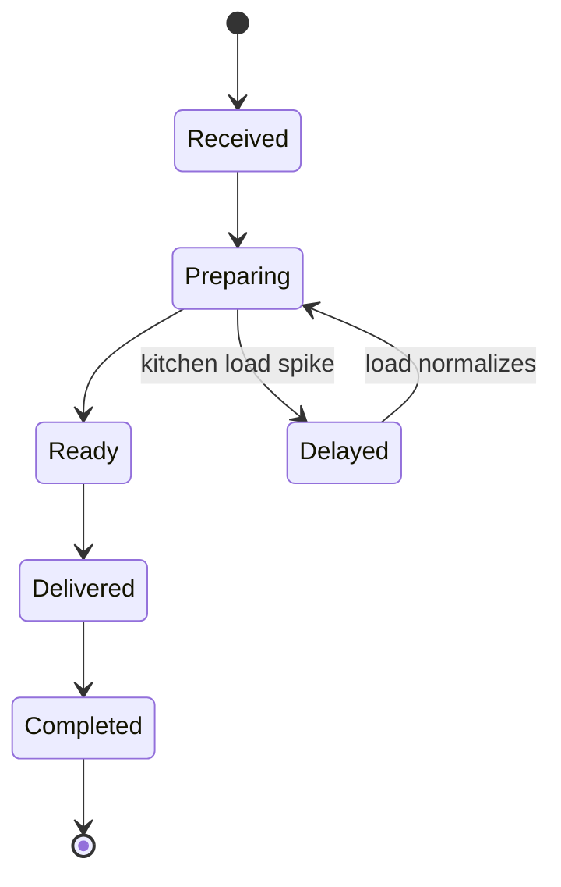
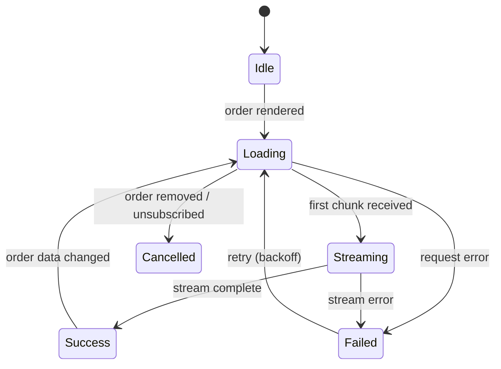
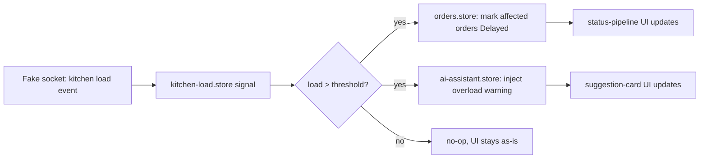
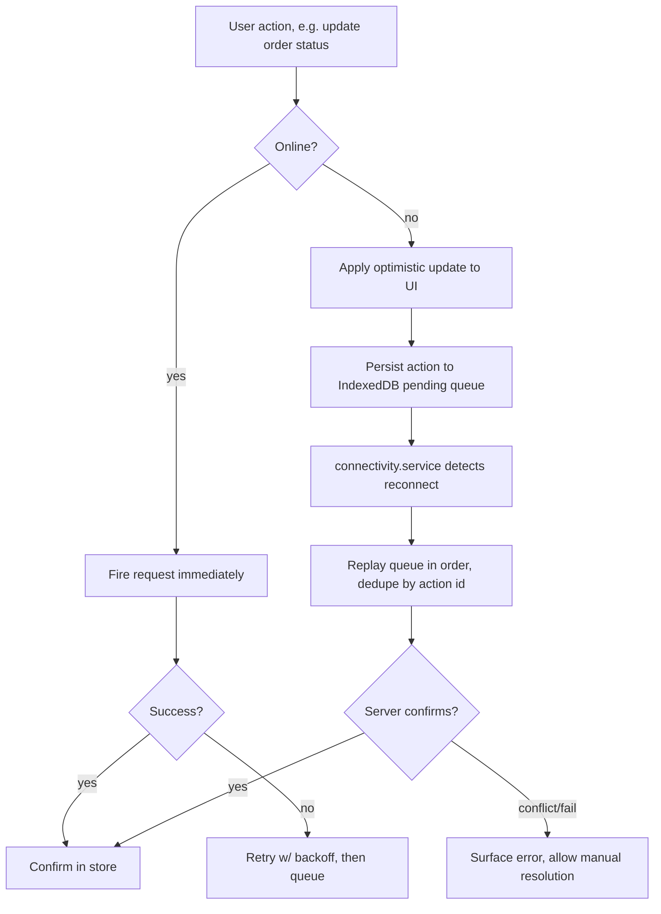
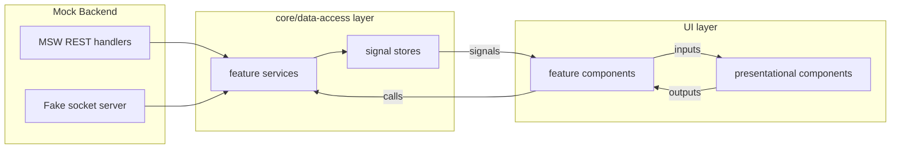

# Sahm Food – Smart Restaurant POS Dashboard
## Hiring Quest Battle Plan

**Deadline:** Tuesday, Jul 28, 2026 · **Target submission:** Sunday night / Monday (buffer day before deadline)
**Today:** Friday, Jul 24, 2026

---

## 1. Exactly What's Needed (checklist)

**Repo**
- [ ] Source code, feature-based architecture
- [ ] README (architecture, folder structure, design decisions, state mgmt, perf, assumptions, limitations, future work)
- [ ] Install instructions + env config (`.env.example`)
- [ ] Automated tests (unit required, integration a plus)
- [ ] Mock backend implementation (source included)
- [ ] Postman/Bruno collection (if mock APIs exposed)
- [ ] Mock datasets used
- [ ] Architecture diagram (optional, recommended — do it, it's cheap points)
- [ ] AI usage disclosure section (tools used, prompts, what's AI-gen vs hand-written, what you rejected and why)

**Video (12–20 min)**
- [ ] Part 1 – Product demo: live updates, AI assistant, search, offline recovery, kitchen load, error/loading states
- [ ] Part 2 – Engineering deep dive: architecture, state mgmt reasoning, component comms, RxJS usage, change detection, lazy loading, testing strategy
- [ ] Part 3 – Live code navigation: folders, shared components, services, state layer, API abstraction, utilities, custom pipes/directives
- [ ] Part 4 – Trade-offs: what you simplified, what you'd improve, tech debt, alternatives considered, path to scaling to hundreds of screens

**5 core modules to build**
1. Live Orders Workspace (multi-channel, status pipeline, live updates, no unnecessary re-render)
2. AI Order Assistant (async, streaming-sim, retry, failure states)
3. Kitchen Load Monitor (live workload → priority/recommendation cascades)
4. Advanced Product Search (debounced, keyboard nav, filters, highlighting, large-dataset perf)
5. Offline Support (optimistic queue, reconnection recovery, dedupe)

---

## 2. Stack & Reasoning (assumption — flag if you want to change)

| Concern | Choice | Why |
|---|---|---|
| State management | **Angular Signals + RxJS services** (no NgRx) | Matches what you actually run in production at Modeer360 — you can defend every decision from lived experience instead of memorized theory. Also genuinely a better fit for a mid-level-facing eval that wants to see *reasoning*, not framework ceremony. |
| Components | Standalone, `OnPush` everywhere | Required to credibly claim "prevented unnecessary re-renders" — one of their named engineering challenges |
| Realtime simulation | RxJS `interval`/`Subject` fake WebSocket service + simulated latency/failure injection | Judged explicitly ("quality of simulation is part of the evaluation") — don't just poll, actually fake a socket abstraction so you can swap it for real WS later |
| Mock backend | MSW (Mock Service Worker) for REST + the fake-WS service above | MSW intercepts at the network layer, so your real `HttpClient` code never knows it's fake — stronger architecture signal than a hardcoded mock service |
| Testing | Jasmine/Karma (default Angular) unless you already have Jest set up elsewhere | Don't burn a day migrating test runners; substance > tooling novelty here |
| Offline | Service worker + IndexedDB (via a small wrapper) for the pending-action queue | You already prototyped offline sync architecture during CineTrack — reuse that mental model |

**Open question for you:** do you want Ionic in this at all (matches your real stack), or pure Angular web since it's explicitly a "browser-based POS"? I'm assuming **pure Angular** below since nothing in the brief mentions mobile/native, and pulling in Capacitor would be scope you don't need to defend under time pressure.

---

## 3. Feature-Based Folder Structure

```
src/app/
├── core/                          # singleton services, app-wide concerns
│   ├── services/
│   │   ├── fake-socket.service.ts       # simulated WebSocket abstraction
│   │   ├── connectivity.service.ts      # online/offline detection
│   │   └── notification.service.ts      # toast/error surface
│   ├── interceptors/
│   │   └── retry.interceptor.ts
│   ├── guards/
│   └── models/
│       └── shared.types.ts
│
├── shared/                        # dumb/presentational, reused across features
│   ├── components/
│   │   ├── skeleton/
│   │   ├── empty-state/
│   │   ├── error-boundary/
│   │   └── badge/
│   ├── pipes/
│   ├── directives/
│   │   └── highlight-match.directive.ts
│   └── utils/
│       ├── debounce.util.ts
│       └── retry-strategy.util.ts
│
├── features/
│   ├── live-orders/
│   │   ├── data-access/
│   │   │   ├── orders.store.ts          # signal-based store
│   │   │   ├── orders.service.ts        # HTTP + socket wiring
│   │   │   └── order.model.ts
│   │   ├── feature/                     # smart/container components
│   │   │   └── orders-workspace.component.ts
│   │   ├── ui/                          # presentational components
│   │   │   ├── order-card/
│   │   │   ├── status-pipeline/
│   │   │   └── channel-tag/
│   │   └── orders.routes.ts
│   │
│   ├── ai-assistant/
│   │   ├── data-access/
│   │   │   ├── ai-assistant.store.ts
│   │   │   ├── ai-assistant.service.ts  # streaming-sim, retry
│   │   │   └── ai-suggestion.model.ts
│   │   ├── feature/
│   │   │   └── ai-panel.component.ts
│   │   └── ui/
│   │       ├── suggestion-card/
│   │       └── streaming-text/
│   │
│   ├── kitchen-monitor/
│   │   ├── data-access/
│   │   │   ├── kitchen-load.store.ts
│   │   │   └── kitchen-load.service.ts
│   │   ├── feature/
│   │   │   └── kitchen-monitor.component.ts
│   │   └── ui/
│   │       └── load-gauge/
│   │
│   ├── product-search/
│   │   ├── data-access/
│   │   │   ├── search.store.ts
│   │   │   └── search.service.ts
│   │   ├── feature/
│   │   │   └── product-search.component.ts
│   │   └── ui/
│   │       ├── search-input/
│   │       ├── result-list/
│   │       └── recent-searches/
│   │
│   └── offline-sync/
│       ├── data-access/
│       │   ├── pending-actions.store.ts
│       │   └── sync.service.ts
│       └── ui/
│           └── offline-banner/
│
├── mock-backend/
│   ├── handlers/                  # MSW request handlers per feature
│   ├── data/                      # seed JSON datasets
│   └── fake-socket-server.ts
│
└── app.routes.ts                  # lazy-loaded per feature
```

**Rule of thumb to state in the README:** `data-access` never imports from `ui`; `ui` components are pure/presentational and receive everything via `input()`/`output()`; `feature` components are the only ones allowed to talk to `data-access`. That single sentence answers their "avoid business logic in components" requirement cleanly.

---

## 4. Feature Breakdown (for planning/estimating)

| # | Feature | Core surface area | Est. effort |
|---|---|---|---|
| 1 | **live-orders** | status pipeline (Received→Preparing→Ready→Delivered→Completed), channel tagging, fake-socket + polling fallback, OnPush + `trackBy`/`@for track` | ~0.75 day |
| 2 | **ai-assistant** | async suggestion fetch per order, loading/streaming/error/retry states, cancellation on order change | ~0.75 day |
| 3 | **kitchen-monitor** | load gauge, cross-feature reaction (load spike → priority badges + AI recs update) | ~0.5 day |
| 4 | **product-search** | debounced input, keyboard nav (↑↓ Enter Esc), category filters, highlight, recent searches (localStorage), virtualized list for large dataset | ~0.75 day |
| 5 | **offline-sync** | connectivity detection, optimistic queue, IndexedDB persistence, replay + dedupe on reconnect | ~0.75 day |
| 6 | **mock-backend** | MSW handlers, seed data, fake-socket server with injectable latency/failure | ~0.5 day (parallelize with feature 1) |
| 7 | **shared/core scaffolding** | skeletons, empty/error states, retry util, connectivity service | ~0.5 day (do first) |
| 8 | **tests** | store logic, search, status transitions, AI state machine, retry, offline sync, 2–3 component tests | ~0.75 day |
| 9 | **README + diagram + AI disclosure** | | ~0.25 day |
| 10 | **video recording + light edit** | | ~0.5 day |

That's ~6 working days of content compressed into 4 calendar days — the plan below front-loads the cross-cutting stuff (module 6 in the walkthrough is the "how does this scale" answer) and treats kitchen-monitor as the smallest, most cuttable module if time runs out.

---

## 5. Simplified Business Logic Diagrams

### 5.1 Order status flow


### 5.2 AI assistant async state machine


### 5.3 Kitchen load → cascading UI reactions


### 5.4 Offline / optimistic update flow


### 5.5 Overall data-flow architecture


Drop these mermaid blocks straight into your README — GitHub renders them natively, so this doubles as your "architecture diagram (optional but recommended)" deliverable for free.

---

## 6. Timeline / Roadmap

**Goal:** feature-complete + tests by end of Sunday, README + video Monday, Monday night submission, Tuesday held as pure buffer.

**Fri Jul 24 (today, evening)**
- Scaffold repo: Angular workspace, routing shell, lazy-loaded feature folders (empty)
- Build `shared/` + `core/` scaffolding (skeletons, empty-state, error-boundary, connectivity service, retry util)
- Stand up MSW + seed dataset shape (orders, products, kitchen load) — even placeholder data is enough to unblock everything else

**Sat Jul 25**
- AM: **live-orders** — status pipeline, fake-socket wiring, channel tags, OnPush + trackBy discipline
- PM: **kitchen-monitor** + wire the cascade (5.3 diagram) into live-orders and ai-assistant stubs
- End of day: order list is live, updating, reacting to load — this is your demo backbone

**Sun Jul 26**
- AM: **ai-assistant** — loading/streaming/error/retry state machine (5.2), request cancellation on order change
- PM: **product-search** — debounce, keyboard nav, highlighting, recent searches, perf pass on large mock dataset
- Evening: **offline-sync** — optimistic queue + IndexedDB + reconnect replay (5.4)
- **Checkpoint:** all 5 modules functionally working by end of Sunday, even if rough

**Mon Jul 27**
- AM: tests — prioritize store logic, status transitions, AI state machine, retry, search debounce (these map directly to their "minimum coverage" list)
- Midday: README (architecture, decisions, trade-offs, assumptions, limitations, future work) + paste in the mermaid diagrams + AI usage disclosure section
- PM: Postman/Bruno collection export, final polish pass (loading states, empty states, a11y sweep — tab order, aria-labels on search/status)
- Evening: record the 12–20 min video in one take per part, light trim, upload
- **Submit Monday night** — gives all of Tuesday as slack for anything that breaks

**Tue Jul 28 (deadline day, buffer only)**
- Reserved for: fixing anything the video/repo review turns up, nothing new started

---

## 7. Assumptions Made (flag any you want changed)

- Pure Angular web app, not Ionic — matches "browser-based POS," avoids unnecessary scope
- Signals + RxJS services over NgRx — matches your real production stack, easier to defend live
- MSW over JSON Server — better simulates a real API boundary, stronger "quality of simulation" score
- Jasmine/Karma (Angular default) over Jest — avoids losing a day to tooling setup
- Kitchen-monitor is the module to cut first if the timeline slips — it's the smallest and most self-contained

Let me know if you want the actual repo scaffolded (I can generate the initial file tree, MSW handler stubs, and the signal stores to save you the Friday-night setup work), or if you'd rather adjust any of the assumptions above first.
